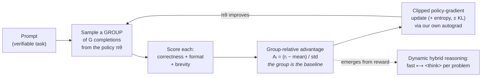

# RL-small-model

**Pure reinforcement learning + dynamic hybrid reasoning to tighten small-model
behavior — implemented from scratch, end to end, in ~1,500 lines of NumPy you can
actually read.**

No PyTorch, no HuggingFace, no GPU. A tiny autograd engine, a small GPT, a full
GRPO trainer, and a dynamic fast-vs-think controller — all transparent, all
tested, all runnable on a laptop CPU in minutes. It's built to *teach*: every file
is short, commented, and gradient-checked, and a seven-part [`docs/`](docs)
walkthrough takes you from "a language model is a policy" to a working pure-RL
loop.

```bash
pip install -r requirements.txt
python examples/quickstart.py       # trains with pure RL, then shows samples
```

---

## Why this exists

Three ideas, one small model:

1. **Pure RL (no supervised fine-tuning).** The model starts from *random weights*
   and learns *only* from a reward signal — the DeepSeek-R1-Zero recipe. No
   demonstration data, no answer keys to imitate. The algorithm is **GRPO** (Group
   Relative Policy Optimization): a critic-free policy gradient that uses a group
   of sampled answers as its own baseline.

2. **Dynamic hybrid reasoning.** One model, two gears — answer **fast** (System 1)
   or write an explicit `<think>` trace then answer (System 2) — with the gear
   chosen *per problem*. It shows up two ways: **learned gating** that emerges
   from the reward, and an explicit **confidence-gated controller** that spends
   reasoning tokens only when the model is unsure.

3. **Tightening behavior.** Small models ramble, misformat, overthink easy things
   and underthink hard ones. Reward shaping + the hybrid gear press the model into
   being correct, well-structured, and no more verbose than the problem needs —
   *without* making it bigger.

The task is deliberately small and **verifiable** — multi-operand arithmetic —
because a clean, computable reward is exactly where pure RL shines, and it has a
built-in difficulty knob that makes "reason only when it helps" meaningful.

## The pure-RL loop at a glance



No value network, no supervised data, no reward model — just a verifier and
relative comparison inside each group.

## The 10-line heart of it

```python
for step in range(num_steps):
    for prompt in sample_prompts():                       # verifiable tasks
        group   = [policy.sample(prompt) for _ in range(G)]   # roll out G answers
        rewards = [verify_and_shape(c) for c in group]        # score each
        adv     = (rewards - mean(rewards)) / std(rewards)    # GRPO: group is the baseline
    loss = -(clipped_surrogate(adv)).mean() - ent*H + kl*KL   # PPO-style objective
    loss.backward(); adam.step()                              # our own autograd
```

Everything else in this repo makes those lines **correct, observable, and
teachable**.

## Quickstart

```bash
pip install -r requirements.txt

# a couple of minutes: watch pure RL learn from scratch, then see sample generations
python examples/quickstart.py

# Full training run, saves a checkpoint under runs/demo/
python scripts/train.py --steps 300 --out runs/demo

# Compare decoding modes (fast / think / learned-auto / confidence-hybrid)
python scripts/evaluate.py --ckpt runs/demo/policy.pkl

# Watch the trained policy solve individual problems, with its reasoning
python scripts/demo.py --ckpt runs/demo/policy.pkl

# Run the test suite (gradient checks + an end-to-end learning test)
make test
```

## Conceptual walkthrough (read these in order)

The [`docs/`](docs) folder is the "solid conceptual grasp" path. Each doc is short
and points at the exact code it explains.

| # | Doc | What you'll understand |
|---|-----|------------------------|
| 1 | [Core concepts](docs/01_concepts.md) | LM-as-policy, pure RL, verifiable rewards, hybrid reasoning |
| 2 | [Pure RL with GRPO](docs/02_pure_rl_grpo.md) | policy gradients → baselines → the group-relative trick → the clipped objective |
| 3 | [Dynamic hybrid reasoning](docs/03_dynamic_hybrid_reasoning.md) | learned gating vs. confidence-gated control; adaptive test-time compute |
| 4 | [Reward design](docs/04_reward_design.md) | shaping, sparse-vs-dense, and a real **reward-hacking war story** from building this repo |
| 5 | [Training loop, line by line](docs/05_training_loop.md) | one `GRPOTrainer.step` end to end |
| 6 | [Scaling to real models](docs/06_scaling_to_real_models.md) | the exact same knobs in TRL on Qwen/Llama small models |
| 7 | [Autograd appendix](docs/07_autograd_appendix.md) | what a deep-learning framework actually does |

## How the code is organized

```
rl_small/
  autograd.py   reverse-mode autodiff over NumPy (gradient-checked)
  nn.py         Linear / Embedding / LayerNorm / GELU
  model.py      TinyGPT — the policy network
  tokenizer.py  tiny arithmetic vocabulary (digits, +/-, <think>, <answer>, …)
  env.py        arithmetic task + verifier (the reward's ground truth)
  rewards.py    correctness + graded shaping + brevity  ← "tightening"
  grpo.py       Group Relative Policy Optimization      ← "pure RL"
  hybrid.py     confidence-gated fast-vs-think decoding  ← "dynamic hybrid reasoning"
  sampling.py   autoregressive rollouts
  optim.py      Adam with global-norm clipping
  evaluate.py   accuracy / reasoning-rate / length, by difficulty and mode
  utils.py      seeding, checkpoints, logging
scripts/        train.py, evaluate.py, demo.py
examples/       quickstart.py (end-to-end in ~40 lines)
tests/          gradient checks, verifier tests, and a learning integration test
docs/           the 7-part conceptual walkthrough
```

## What you'll see when it trains

Pure RL from random init climbs a ladder (this is the whole story in one place):

1. **Structure first (robust, every run).** In a few dozen steps the policy goes
   from emitting random garbage — malformed, non-terminating, `0%` parseable — to
   clean, well-formed `<answer> … </answer> <eos>`. Mean reward climbs from
   *negative* to roughly `+0.5`, and `gen_len` settles onto tidy direct answers.
   This is the clearest, most reproducible signal that pure RL is working.
2. **Correctness lifts above chance.** Once structure is solved, the large
   correctness bonus pulls answers toward *right*, to a few× the random-guess
   baseline. Be clear-eyed about scale, though: this model **reliably nails the
   format long before it masters the arithmetic**, and from *random weights* the
   accuracy is bumpy — individual steps spike, then the policy partially collapses
   toward a couple of constant answers and recovers. That instability is
   **exploration collapse**, a real and important pure-RL phenomenon (the group
   briefly loses answer diversity, so GRPO loses the variance it needs — see
   [doc 2 §2.2](docs/02_pure_rl_grpo.md) and the entropy bonus that fights it).
   The training scripts keep the **best-by-held-out-accuracy** snapshot so the
   final policy is a good one, not a post-collapse one.
3. **Behavior tightens.** The brevity penalty trims needless tokens; on a
   difficulty spread, reasoning is rewarded only where it pays, so `reasoning_rate`
   sorts by difficulty and the confidence-gated controller trades compute for
   accuracy on demand.

> **On the numbers, honestly.** This is a *teaching* setup: a
> tens-of-thousands-parameter model learning a symbolic mapping from a **sparse
> reward** and **random initialization** — the hardest possible starting point.
> The mechanisms are exercised end-to-end and the format/reward gains are rock
> solid; robust high-accuracy *mastery* is exactly what a **pretrained base model**
> buys you, which is why real pure-RL (R1-Zero) starts there.
> [doc 6](docs/06_scaling_to_real_models.md) spells out what changes at scale.
> Reproduce on your machine with `make train && make evaluate`; results vary by
> seed by design.

## Honest caveats

- This is a **teaching implementation**. TinyGPT is tens of thousands of
  parameters and the task is toy arithmetic — enough to make every mechanism
  visible and reproducible on a CPU, not to set benchmarks.
- Pure RL from *random* init is finicky (sparse reward, exploration collapse). We
  address it with graded reward shaping and an optional dense proximity reward, and
  we document the failure modes we hit — including a genuine reward-hack — in
  [doc 4](docs/04_reward_design.md). Real systems sidestep much of this by starting
  from a pretrained base; [doc 6](docs/06_scaling_to_real_models.md) explains what
  changes.
- The math and algorithms (GRPO, the clipped surrogate, group-relative advantage,
  hybrid decoding) are the *same* ones used at scale. That's the point: understand
  them here, apply them there.

## References

- **DeepSeek-R1 / R1-Zero** — pure RL producing emergent reasoning.
- **DeepSeekMath (GRPO)** — the algorithm, derived from scratch in [doc 2](docs/02_pure_rl_grpo.md).
- **PPO** — the clipped surrogate objective GRPO borrows.
- **TRL `GRPOTrainer`** — the production API mirrored in [doc 6](docs/06_scaling_to_real_models.md).

## License

MIT — see [LICENSE](LICENSE).
